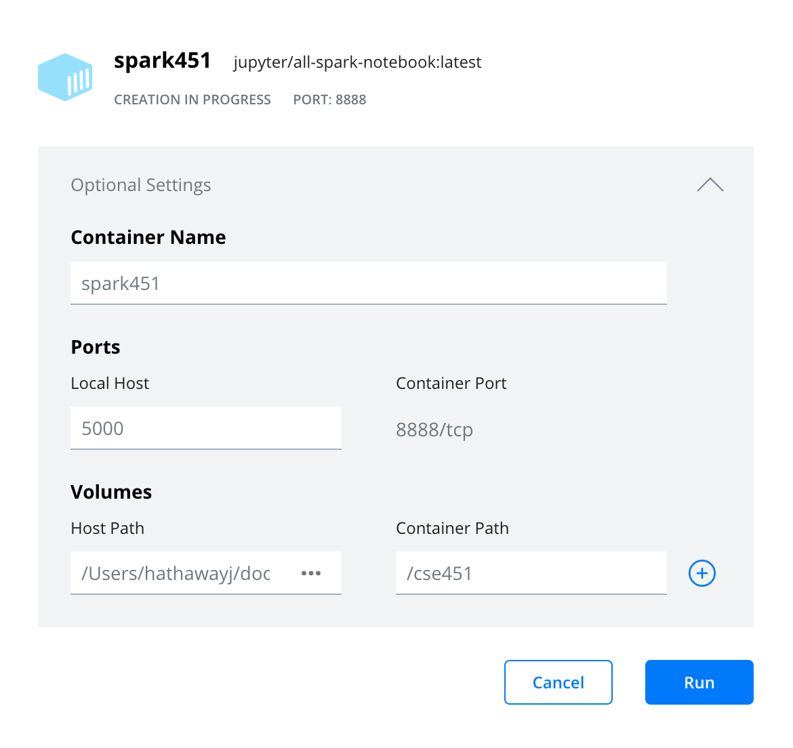
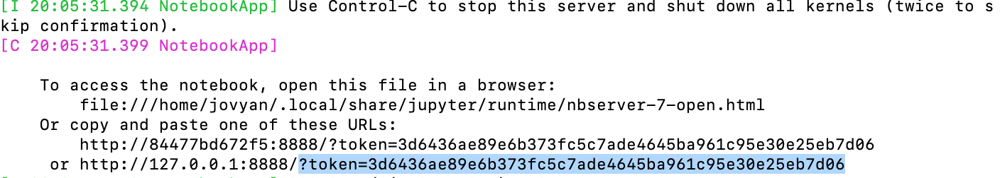
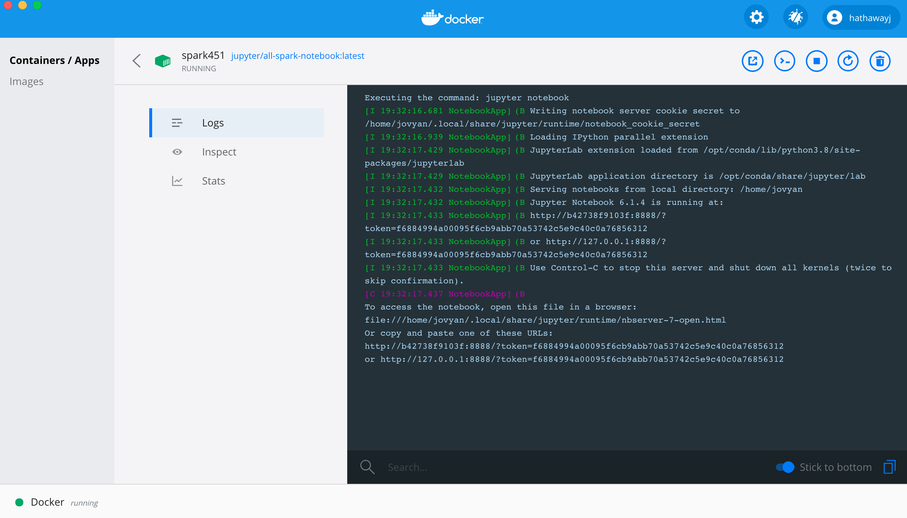

# Docker 

## Introduction

> Docker is to containers as Google is to search

'A container is a special type of process that is isolated from other processes. Containers are assigned resources that no other process can access, and they cannot access any resources not explicitly assigned to them.' The advantages of containers is that a company can create an isolated computer within a computer which provides security and consistency. [raygun.com](https://raygun.com/blog/what-is-docker/#:~:text=In%20conclusion%2C%20Docker%20is%20popular,create%20vast%20economies%20of%20scale.) 

### What are containers?

'Containers sit on top of a physical server and its host OS—for example, Linux or Windows. Each container shares the host OS kernel and, usually, the binaries and libraries, too. Shared components are read-only. Containers are thus exceptionally “light”—they are only megabytes in size and take just seconds to start, versus gigabytes and minutes for a Virtual Machines.'

'Containers also reduce management overhead. Because they share a common operating system, only a single operating system needs care and feeding for bug fixes, patches, and so on. In short, containers are lighter weight and more portable than VMs.' [blog.netap.com](https://blog.netapp.com/blogs/containers-vs-vms/)

### Why Docker?

'Docker enables developers to easily pack, ship, and run any application as a lightweight, portable, self-sufficient container, which can run virtually anywhere. Containers gives you instant application portability.' 

Containers do this by enabling developers to isolate code into a single container. This makes it easier to modify and update the program. It also lends itself, as Docker points out, for enterprises to break up big development projects among multiple smaller, Agile teams using Jenkins, an open-source CI/CD program, to automate the delivery of new software in containers.[zdnet.com](https://www.zdnet.com/article/what-is-docker-and-why-is-it-so-darn-popular/)

> Docker is to containers as GitHub is to Git

Docker brings several new things to the table that the earlier technologies didn't. The first is it's made containers easier and safer to deploy and use than previous approaches. In addition, because Docker's partnering with the other container powers, including Canonical, Google, Red Hat, and Parallels, on its key open-source component libcontainer, it's brought much-needed standardization to containers.

Since then Docker donated "its software container format and its runtime, as well as the associated specifications," to The Linux Foundation's Open Container Project. Specifically, "Docker has taken the entire contents of the libcontainer project, including nsinit, and all modifications needed to make it run independently of Docker, and donated it to this effort." [zdnet.com](https://www.zdnet.com/article/what-is-docker-and-why-is-it-so-darn-popular/)

### Docker for data science?

Using docker containers means you don't have to deal with "works on my machine" problems. Generally, the main advantage Docker provides is standardization. This means you can define the parameters of your container once, and run it wherever Docker is installed. This in turn provides a few major advantages:

1. __Reproducibility:__ Everyone has the same OS, the same versions of tools etc. If it works on your machine, it works on everyone's machine.
2. __Portability:__ This means that moving from local development to a super-computing cluster is easy. Also, if you're working on open source data science projects you can provide collaborators with an easy way to bypass setup hassle.
3. __Docker Hub:__ You can take advantage of the community to find pre-built images [search here](https://hub.docker.com/search?q=data%20science&type=image)

Another huge advantage – learning to use Docker will make you a better engineer, or turn you into a data scientist with super powers. Many systems rely on Docker, and it will help you turn your ML projects into applications and deploy models into production. [dagshub.com](https://dagshub.com/blog/setting-up-data-science-workspace-with-docker/)

## Getting started using `docker run`

1. [Install Docker Desktop](https://www.docker.com/get-started)
2. [Create a Dockerhub account](https://hub.docker.com/signup)
3. [Pull the jupyter/all-spark-notebook](https://hub.docker.com/r/jupyter/all-spark-notebook) `docker pull jupyter/all-spark-notebook`
4. Create a docker network `docker network create n451`
5. Start your Docker all-spark-notebook container - map to a folder path on your computer to a docker volume. I have included my path (`/Users/hathawayj/git/BYUI451/docker_guide/data`) which you will need to change. The path to the right of `:` will stay the same.

We will see how to [create a Docker compose yaml](https://docs.docker.com/compose/) a little later. The Docker compose yaml includes a Postgress and Adminer container as well.  You can read about creating those containers using `docker run` at [database.md](database.md). In trying to get all three containers to communicate, you will see the need for step 4 above.

_Note that the command line versions require that the full local volume path is specified. We will be able to use relative file paths with the yaml._

__Command Line: Mac__'"

```bash
docker run --name spark -it \
  -p 8888:8888 -p 4040:4040 -p 4041:4041 \
  -v /Users/hathawayj/git/BYUI451/docker_guide/data:/home/jovyan/data \
  -v /Users/hathawayj/git/BYUI451/docker_guide/scripts:/home/jovyan/scripts \
  -v /Users/hathawayj/git/BYUI451/docker_guide/scratch:/home/jovyan/scratch \
  -v /Users/hathawayj/git/BYUI451/docker_guide/work:/home/jovyan/work \
  --network n451 \
  jupyter/all-spark-notebook
```

__Command Line: Windows__

```bash
docker run --name spark -it ^
  -p 8888:8888 -p 4040:4040 -p 4041:4041 ^
  -v C:/git/BYUI451/docker_guide/data:/home/jovyan/data ^
  -v C:/git/BYUI451/docker_guide/scripts:/home/jovyan/scripts ^
  -v C:/git/BYUI451/docker_guide/scratch:/home/jovyan/scratch ^
  -v C:/git/BYUI451/docker_guide/work:/home/jovyan/work ^
  --network n451 ^
  jupyter/all-spark-notebook
```

- [latest java jar for postgres](https://jdbc.postgresql.org/download.html)
- [postgresql-42.2.18.jar in repo](scratch/postgresql-42.2.18.jar)

__Docker Desktop__



6. Now open [http://localhost:8888/lab](http://localhost:8888/lab?token=) and paste `?token=` plus the token shown at the end of the url.

You can find the token in the terminal or in the logs.

| Terminal | Docker Desktop Logs |
|----------|---------------------|
| |  |

With `docker run` we can get a full Spark environment up and running on our computer in minutes. In this container, we can practice our Spark magic and even speed up some of the work we would do in pandas.  Spend some time in Jupyter Lab getting used to Spark. Here are some great links to help you with pyspark.

- [pyspark-examples](https://github.com/spark-examples/pyspark-examples)
- [PySpark Cheat Sheet](https://s3.amazonaws.com/assets.datacamp.com/blog_assets/PySpark_SQL_Cheat_Sheet_Python.pdf)
- [PySpark SQL Cheat Sheet](https://intellipaat.com/mediaFiles/2019/03/PySpark-SQL-cheat-sheet.jpg)

You could try using the [master files](https://www.irs.gov/charities-non-profits/exempt-organizations-business-master-file-extract-eo-bmf) from the United States IRS 990 forms about non-profit companies. Find the four region `.csv` files and explore.
## Getting started using `docker-compose`

To use this section, I am assuming the following.

- You have cloned this repo to your local computer.
- You have a terminal open at the file path of this cloned repo.
- You have reviewed the [database.md](database.md) guide on the postgress and Adminer containers.
- You have examined the [docker-compose.yml](docker-compose.yml) file.

We can create a docker compose `.yml` that automates a bit of the work we went through above. Once the `.yml` is created, we can simply tell `docker-compose` to build our docker containers. Here are the steps

1. Clone this repository to your computer.
2. Open your terminal and navigate to your git repo directory you just cloned. (Mac: `pwd`, Windows:`cd` to see your working directory)
3. If your terminal is open in the git directory, you can run the `docker-compose`.  The full command - `docker-compose -p c451 -f docker-compose.yml up`.

One difference is that each docker container will now have new names. 

| docker-compose name     | docker run name     | 
| ----------------------- | ------------------- | 
| _c451_db_1_             | db                  | 
| _c451_spark_1_          | spark               | 
| _c451_adminer_1_        | adminer             | 

With these new names a few commands and inputs will need to be updated.  For example, to get into the new postgres container we would run `docker exec -it c451_db_1 sh`.

## Other readme.md files

- [Postgres database Docker support](database.md)
- [Docker CLI and psql](command_line_containers.md)
- [Spark Guide using our Docker containers](https://github.com/BYUI451/spark_guide)

[^1]: [raygun.com](https://raygun.com/blog/what-is-docker/#:~:text=In%20conclusion%2C%20Docker%20is%20popular,create%20vast%20economies%20of%20scale.)
[^2]: [blog.netap.com](https://blog.netapp.com/blogs/containers-vs-vms/)
[^3]: [zdnet.com](https://www.zdnet.com/article/what-is-docker-and-why-is-it-so-darn-popular/)
[^4]: [dagshub.com](https://dagshub.com/blog/setting-up-data-science-workspace-with-docker/)
[^5]: https://docs.bitnami.com/installer/infrastructure/mapp/administration/backup-restore-postgresql/ and https://markheath.net/post/exploring-postgresql-with-docker
